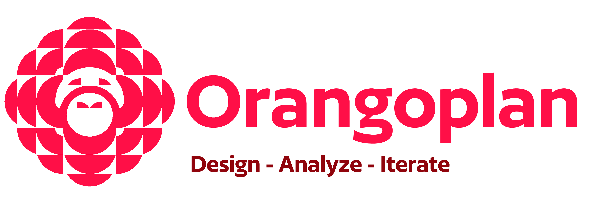

---
hide:
  # - navigation
  - toc
---

  

  <h4> OrangoPlan is a parametric urban analysis and design toolkit for Rhino–Grasshopper that enables real-time evaluation of spatial, network, and urban performance within iterative design workflows.</h4>

[Getting Started](Home/Getting_Started.md){ .md-button .md-button--primary }
 &nbsp;
 

  <video autoplay loop muted playsinline style="max-width: 95%;">
    <source src="assets/Sample.mp4" type="video/mp4">
    Your browser doesn't support video playback.
  </video>

 &nbsp;

 <!--   -->

  <h5> The development of OrangoPlan is driven by a commitment to knowledge sharing and is released as a free plugin to encourage widespread adoption of sustainable, data-informed design practices.</h5>

&nbsp;

